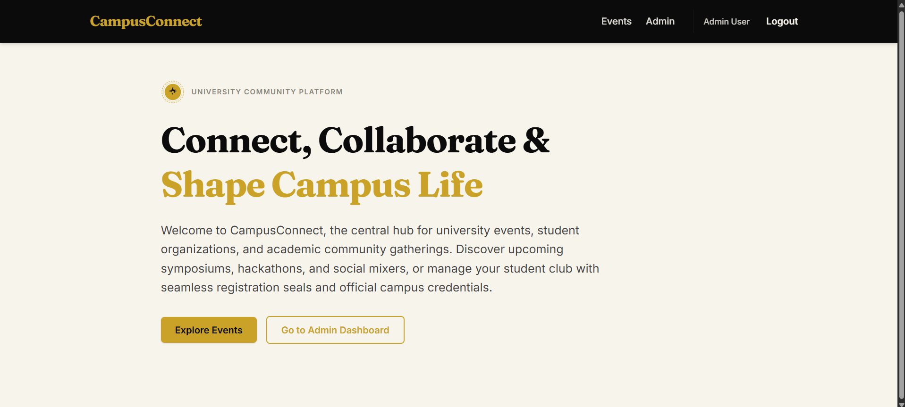
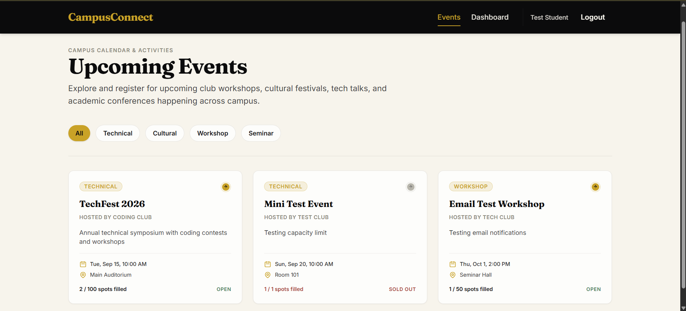
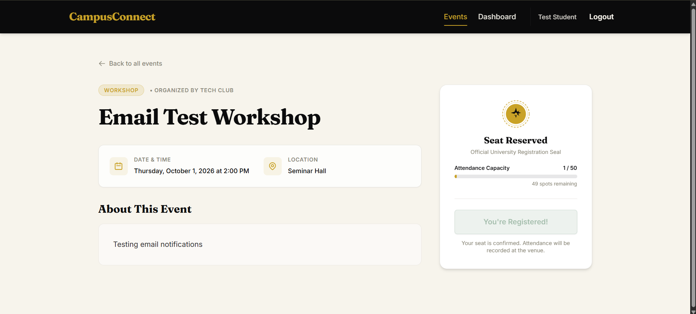
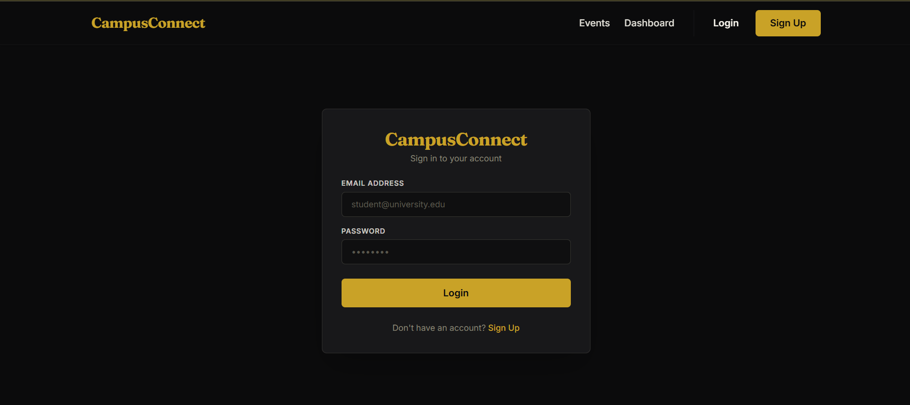
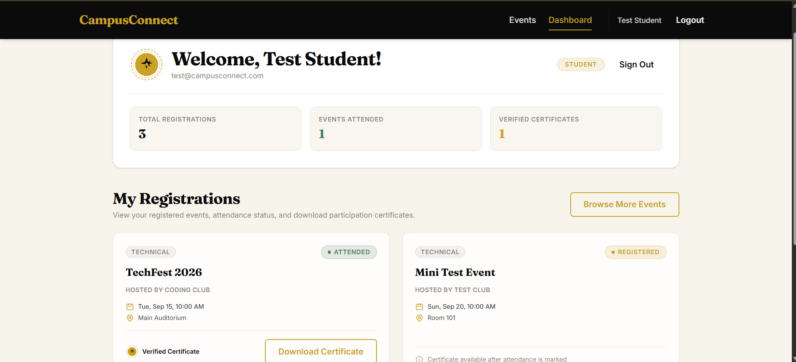
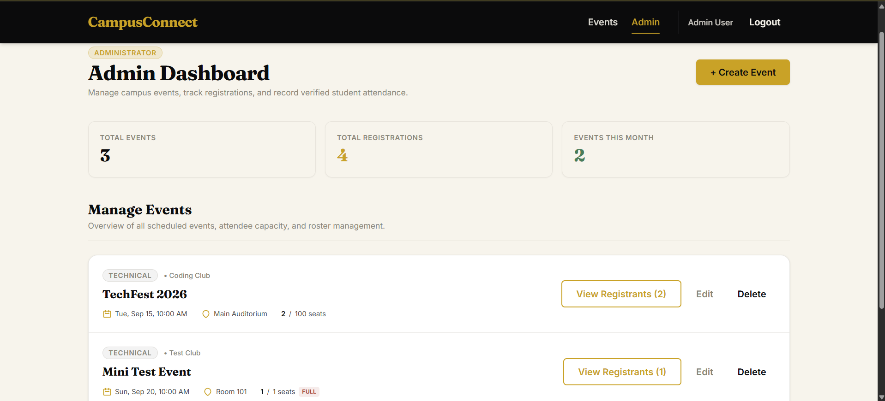
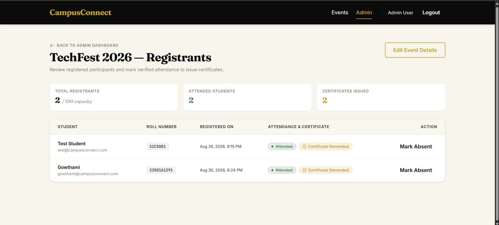
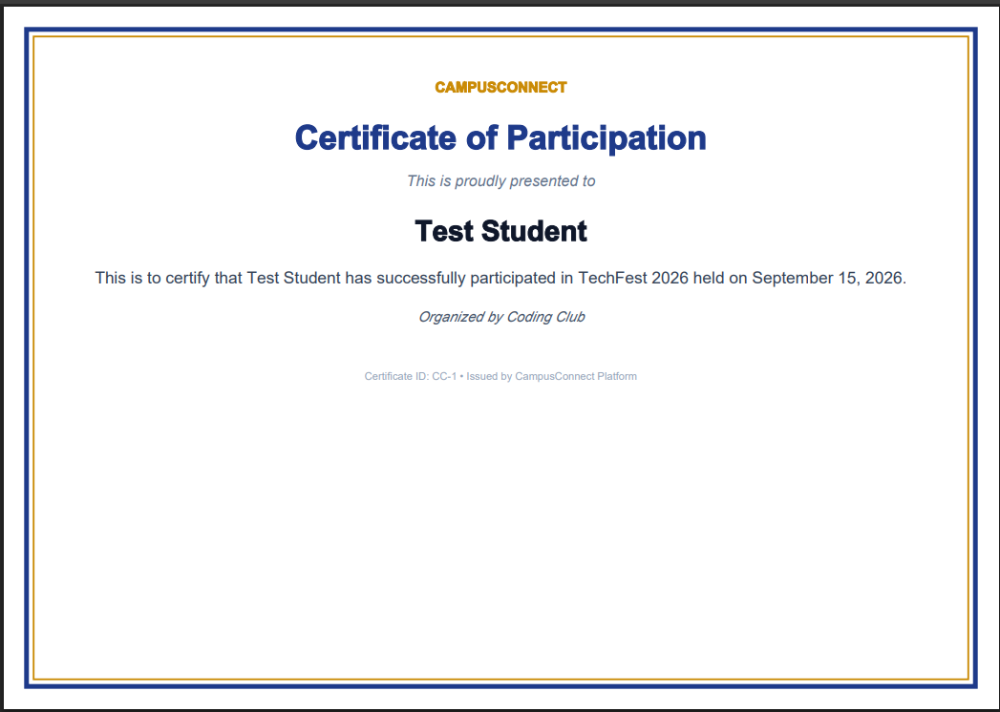

# CampusConnect

A full-stack college event management and registration platform, built with **Spring Boot (Java)** on the backend and **React** on the frontend.

Students can browse campus events, register for them, and download verified participation certificates. Admins can create events, track registrations, and mark attendance to issue certificates automatically.

---

## Features

### Student
- Secure signup/login with JWT authentication
- Browse and filter events by category (Technical, Cultural, Workshop, Seminar)
- Register for events with real-time seat availability
- Automatic email confirmation on registration
- Personal dashboard showing registration history and attendance status
- Download auto-generated PDF certificates once attendance is marked

### Admin
- Role-based access control (Student / Admin / Club Coordinator)
- Create, edit, and delete events
- View registrants for any event
- Mark student attendance, which automatically triggers certificate generation
- Dashboard with platform-wide stats (total events, registrations, monthly activity)

### Engineering Highlights
- **Capacity-safe registration** — prevents overbooking and duplicate registrations using transactional checks
- **JWT-based stateless authentication** with Spring Security, role-based route protection on both frontend and backend
- **Auto-generated PDF certificates** (OpenPDF) tied to verified attendance
- **Email notifications** on registration (SMTP via Mailtrap for development)
- Clean, custom-designed UI (black/gold/ivory theme) built with Tailwind CSS

---

## Tech Stack

| Layer | Technology |
|---|---|
| Backend | Java 21, Spring Boot, Spring Security, Spring Data JPA |
| Database | MySQL |
| Auth | JWT (jjwt) |
| PDF Generation | OpenPDF |
| Email | Spring Mail (SMTP) |
| Frontend | React (Vite), React Router, Tailwind CSS v4 |
| HTTP Client | Axios |

---

## Project Structure

```
campusconnect/
├── backend/          # Spring Boot REST API
│   └── src/main/java/com/campusconnect/backend/
│       ├── model/         # JPA entities
│       ├── repository/    # Spring Data repositories
│       ├── service/       # Business logic
│       ├── controller/    # REST endpoints
│       ├── security/      # JWT auth, filters
│       └── config/        # Security & CORS config
│
└── frontend/          # React (Vite) SPA
    └── src/
        ├── components/     # Reusable UI components
        ├── pages/          # Route-level pages
        ├── context/        # Auth context/state
        └── services/       # API service layer
```

---

## Getting Started

### Prerequisites
- Java 17 or 21 (JDK)
- Node.js (LTS)
- MySQL Server
- Maven (or use the included `mvnw` wrapper)

### Backend Setup

1. Create a MySQL database:
   ```sql
   CREATE DATABASE campusconnect;
   ```

2. Configure `backend/src/main/resources/application.properties`:
   ```properties
   spring.datasource.url=jdbc:mysql://localhost:3306/campusconnect
   spring.datasource.username=root
   spring.datasource.password=YOUR_MYSQL_PASSWORD
   spring.jpa.hibernate.ddl-auto=update

   spring.mail.host=sandbox.smtp.mailtrap.io
   spring.mail.port=2525
   spring.mail.username=YOUR_MAILTRAP_USERNAME
   spring.mail.password=YOUR_MAILTRAP_PASSWORD

   app.jwt.secret=your-secret-key
   app.jwt.expirationMs=86400000
   ```

3. Run the backend:
   ```bash
   cd backend
   ./mvnw spring-boot:run
   ```
   Server starts at `http://localhost:8080`

### Frontend Setup

```bash
cd frontend
npm install
npm run dev
```
App runs at `http://localhost:5173`

---

## API Overview

| Method | Endpoint | Description | Access |
|---|---|---|---|
| POST | `/api/auth/register` | Register a new user | Public |
| POST | `/api/auth/login` | Login, returns JWT | Public |
| GET | `/api/events` | List all events | Public |
| GET | `/api/events/{id}` | Get event details | Public |
| POST | `/api/events` | Create event | Admin/Coordinator |
| PUT | `/api/events/{id}` | Update event | Admin/Coordinator |
| DELETE | `/api/events/{id}` | Delete event | Admin/Coordinator |
| POST | `/api/registrations/{eventId}` | Register for an event | Authenticated |
| GET | `/api/registrations/me` | View own registrations | Authenticated |
| GET | `/api/registrations/event/{eventId}` | View event's registrants | Admin/Coordinator |
| PUT | `/api/registrations/{id}/attendance` | Mark attendance | Admin/Coordinator |
| GET | `/api/registrations/{id}/certificate` | Download certificate PDF | Authenticated |

---

## Test Accounts

For demo/testing purposes:

| Role | Email | Password |
|---|---|---|
| Student | test@campusconnect.com | password123 |
| Admin | admin@campusconnect.com | admin123 |

---

## Screenshots

**Landing Page**


**Events Listing**


**Event Details**


**Sign Up**


**Student Dashboard**


**Admin Dashboard**


**Registrants & Attendance**


**Generated Certificate**


---

## Future Enhancements

- Club-wise event approval workflow
- Post-event feedback collection
- Calendar view for browsing events
- Waitlist support for full events

---

## Author

Built by Gowthami.
